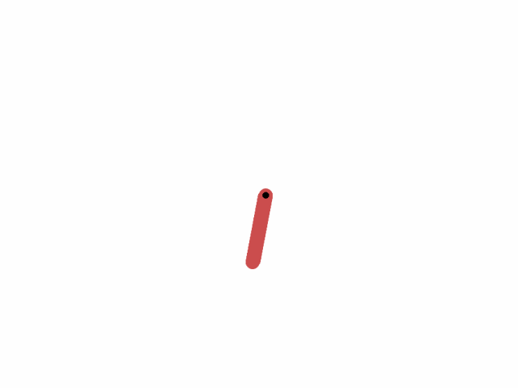

# Reinforcement-Learning

---

| **Algorithms from Reinforcement Learning: An Introduction by Andrew Barto and Richard S. Sutton**                          | **Environment (Name & Goal)**               | **Environment GIF**                           | **Plots**               |
|----------------------------------------|---------------------------------------------|-----------------------------------------------|-------------------------------------------|
| [Policy Iteration](#policy-iteration)  | **Frozen Lake**: The player makes moves until they reach the goal or fall in a hole. The lake is slippery (unless disabled) so the player may move perpendicular to the intended direction sometimes.               |      | - |
| [Value Iteration](#value-iteration)    | **Taxi-v3**: The taxi starts at a random location within the grid. The passenger starts at one of the designated pick-up locations. The passenger also has a randomly assigned destination (one of the four designated locations).                |        | - |
| [Monte Carlo Exploring Starts](#monte-carlo-exploring-starts) | **Blackjack-v1**: a card game where the goal is to beat the dealer by obtaining cards that sum to closer to 21 (without going over 21) than the dealer's cards        |   |   |
| [Sarsa](#sarsa)                        | **CliffWalking-v0**: Reach goal without falling  |            |   Sarsa: Orange       |
| [Q-learning](#q-learning)              | **CliffWalking-v0**: Reach goal without falling  |       |   Q-learning: Blue    |
| [Expected Sarsa](#expected-sarsa)      | **CliffWalking-v0**: Reach goal without falling  |   |   Expected Sarsa: Green |
| [Double Q-learning](#double-q-learning)          | **CliffWalking-v0**: Reach goal without falling  |   |  Double Q-learning: Red |
| n-step Bootstrapping **(TODO)**        | -                                           | -                                             | -                                         |
| Planning and Learning with Tabular Methods **(TODO)** | -                                   | -                                             | -                                         |
| [Monte-Carlo Policy-Gradient](#monte-carlo-policy-gradient) | **CartPole-v1**: goal is to balance the pole by applying forces in the left and right direction on the cart.                 |                |          |
| [REINFORCE with Baseline](#reinforce-with-baseline) | **CartPole-v1**: goal is to balance the pole by applying forces in the left and right direction on the cart.                 |   | - |
| [One-Step Actor-Critic](#one-step-actor-critic) | **CartPole-v1**: goal is to balance the pole by applying forces in the left and right direction on the cart.                 |         |  |
| Policy Gradient on Continuous Actions **(TODO)** | -                                    | -                                             | -                                         |
| On-policy Control with Approximation **(TODO)** | -                                   | -                                             | -                                         |
| Off-policy Methods with Approximation **(TODO)** | -                                   | -                                             | -                                         |
| Eligibility Traces **(TODO)**          | -                                           | -                                             | -                                         |


---

# Deep Reinforcement Learning: Paper Implementations

| **Year** | **Paper**                                                       | **Environment (Name & Goal)**               | **Environment GIF**                           | **Plots**               |
|----------|-----------------------------------------------------------------|---------------------------------------------|-----------------------------------------------|-------------------------|
| 2013     | [Playing Atari with Deep Reinforcement Learning](#)             | **ALE/Pong-v5** - You control the right paddle, you compete against the left paddle controlled by the computer. You each try to keep deflecting the ball away from your goal and into your opponent’s goal.   |                  |    |
| 2014     | [Deep Deterministic Policy Gradient (DDPG)](#)                  | **Pendulum-v1** - The pendulum starts in a random position and the goal is to apply torque on the free end to swing it into an upright position, with its center of gravity right above the fixed point.     |                 |  |
| 2015, 2016     | [Deep Reinforcement Learning with Double Q-Learning + Prioritized Experience Replay](#)         | -                   |                     |  |
| 2017     | [Proximal Policy Optimization (PPO)](#)                         | **LunarLander-v3**: This environment is a classic rocket trajectory optimization problem. According to Pontryagin’s maximum principle, it is optimal to fire the engine at full throttle or turn it off                 |                  |  |
| 2018     | [Soft Actor-Critic (SAC)](#)                                    | - |               | alpha not learnable (not enough exploration ig, that's why sum of reward is going down sometimes...?):  |
| 2017     | [Mastering the Game of Go without Human Knowledge](#)           | Go - Win against self-played adversary       |                    |  |
| 2017     | [AlphaZero](#)                                                  | Chess - Beat traditional engines             |               |  |
| 2020     | [Mastering Atari, Go, Chess and Shogi with a Learned Model](#)  | Multiple Environments (Planning with Models)|                 |  |
| 20xx     | [AlphaFold](#)                                                  | Protein Folding - Predict protein structures|      |  |


---

## Reinforcement Learning: An Introduction by Andrew Barto and Richard S. Sutton
> Below links don't redirect anywhere, gotta refactor the code and add links, for now go to the repo directly👆
* [Dynamic Programming]()
  * [Policy Iteration - Policy Evaluation & Policy Iteration]()
  * [Value Iteration]()
* [Monte-Carlo Methods]()
  * [Monte Carlo Exploring Starts]()
* [Temporal-Difference (Tabular)]()
  * [Sarsa]()
  * [Q-learning]()
  * [Expected Sarsa]()
  * Double Q-learning **(TODO)**
* [n-step Bootstrapping (**TODO**)]
* Planning and Learning with Tabular Methods (**TODO**)
* [On-policy Prediction with Approximation]()
  * Covered in [Papers]() Section, where we use function approximators like Neural Networks for RL
* On-policy Control with Approximation (**TODO**)
* Off-policy Methods with Approximation (**TODO**)
* Eligibility Traces (**TODO**)
* [Policy Gradient Methods]()
  * [Monte-Carlo Policy-Gradient]()
  * [REINFORCE with Baseline]()
  * [One-Step Actor-Critic]()
  * Policy Gradient on Continuous Actions (**TODO**)

---
## Reinforcement Learning: Paper Implementations
> Below links don't redirect anywhere, gotta refactor the code and add links, for now go to the repo directly👆
* [2013: Playing Atari with Deep Reinforcement Learning]()
* Prioritized DDQN || 2015: Deep Reinforcement Learning with Double Q-learning **+** 2016 Prioritized Experience Replay || **(TODO)**
* [2017: Proximal Policy Optimization (PPO)]()
* [2014: Deep Deterministic Policy Gradient]()
* 2018: Soft Actor-Critic **(TODO)**
* AlphaGo, AlphaZero, AlphaFold, etc: **(TODO)**
  * 2017: Mastering the game of go without human knowledge
  * 2017: AlphaZero
  * 2020: Mastering Atari, Go, chess and shogi by planning with a learned model
  * 20xx: AlphaFold


> 👇 Not Updated... Go to the repo files directly. To see the agent act in the env, see .gif files in images folder

<div style="display: flex; justify-content: space-around; align-items: center; flex-wrap: wrap;">
  
  
  
  
</div>


## Playing Atari with Deep Reinforcement Learning
```python
pip install -r requirements.txt # INSTALL REQUIRED LIBRARIES
python dqn.py # TO TRAIN FROM SCRATCH
python dqn_play.py # TO GENERATE .gif OF AI AGENT PLAYING PONG
```


## (Important Clips from the paper)
* The
model is a convolutional neural network, trained with a variant of Q-learning,
whose input is raw pixels and whose output is a value function estimating future
rewards. We apply our method to seven Atari 2600 games from the Arcade Learning
Environment, with no adjustment of the architecture or learning algorithm

### Introduction
* Most successful RL applications
that operate on these domains have relied on hand-crafted features combined with linear value
functions or policy representations. Clearly, the performance of such systems heavily relies on the
quality of the feature representation.
* Firstly, most successful deep learning applications to date have required large amounts of hand labelled
training data
* RL algorithms, on the other hand, must be able to learn from a scalar reward
signal that is frequently sparse, noisy and delayed. The delay between actions and resulting rewards,
which can be thousands of timesteps long, seems particularly daunting when compared to the direct
association between inputs and targets found in supervised learning
* Another issue is that most deep
learning algorithms assume the data samples to be independent, while in reinforcement learning one
typically encounters sequences of highly correlated states
* Furthermore, in RL the data distribution
changes as the algorithm learns new behaviours, which can be problematic for deep learning
methods that assume a fixed underlying distribution

* The network is
trained with a variant of the Q-learning [26] algorithm, with stochastic gradient descent to update
the weights. To alleviate the problems of correlated data and non-stationary distributions, we use
an experience replay mechanism [13] which randomly samples previous transitions, and thereby
smooths the training distribution over many past behaviors
* The network was not provided
with any game-specific information or hand-designed visual features, and was not privy to the
internal state of the emulator; it learned from nothing but the video input, the reward and terminal
signals, and the set of possible actions—just as a human player would. Furthermore the network architecture
and all hyperparameters used for training were kept constant across the games

### Background
* 
* 

### Deep Reinforcement Learning
* Experience replay where we store the agent’s experiences at each time-step, et = (st; at; rt; st+1)
in a data-set D = e1; :::; eN, pooled over many episodes into a replay memory. During the inner
loop of the algorithm, we apply Q-learning updates, or minibatch updates, to samples of experience,
e  D, drawn at random from the pool of stored samples. After performing experience replay,
the agent selects and executes an action according to an eps-greedy policy
* 
* Advantages:
  * First, each step of experience is potentially used in many weight updates, which allows for greater data efficiency.
  * Second, learning directly from consecutive samples is inefficient, due to the strong correlations
between the samples; randomizing the samples breaks these correlations and therefore reduces the
variance of the updates
  * Third, when learning on-policy the current parameters determine the next
data sample that the parameters are trained on. For example, if the maximizing action is to move left
then the training samples will be dominated by samples from the left-hand side; if the maximizing
action then switches to the right then the training distribution will also switch. It is easy to see how
unwanted feedback loops may arise and the parameters could get stuck in a poor local minimum, or
even diverge catastrophically. Note that when learning by experience replay, it is necessary to learn off-policy
(because our current parameters are different to those used to generate the sample), which motivates
the choice of Q-learning

* In practice, our algorithm only stores the last N experience tuples in the replay memory, and samples
uniformly at random from D when performing updates. This approach is in some respects limited
since the memory buffer does not differentiate important transitions and always overwrites with
recent transitions due to the finite memory size N. Similarly, the uniform sampling gives equal
importance to all transitions in the replay memory. A more sophisticated sampling strategy might
emphasize transitions from which we can learn the most, similar to prioritized sweeping


### Experiments
* 

## Q-learning, Sarsa and Expected Sarsa on Cliff-Walking
```python
python qlearning_sarsa_expectedsarsa_on_cliff_walking.py --animation True --experiments True
```
<div style="display: flex; justify-content: space-around; align-items: center; flex-wrap: wrap;">
  
  
  
</div>

* Q-learning learns the optimal policy that travels right along the edge, this may result in the agent occasionally falling off the cliff when **TRAINING** (not during inference) with an epsilon-greedy policy which is the reason for getting a lower `sum of rewards` during training than Sarsa and Expected Sarsa
<div style="display: flex; justify-content: space-around; align-items: center; flex-wrap: wrap;">
  
  
  
  
  
  
  
  
</div>


